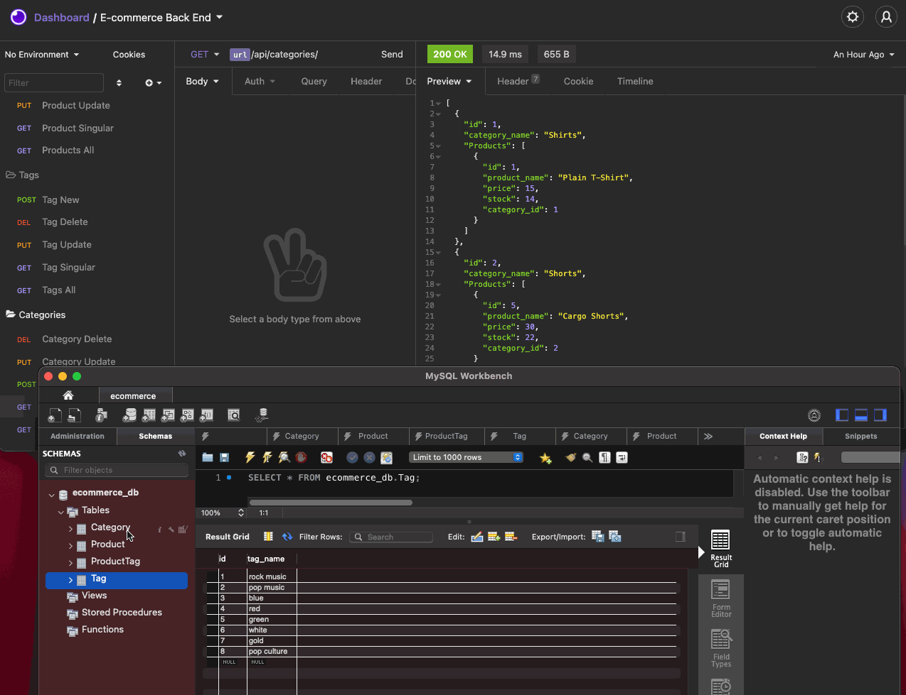
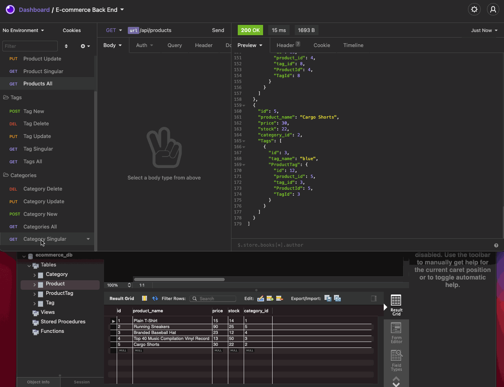

# E-commerce Back End

A functioning back end for an e-commerce site.
Created using modified statrter code (provided by TRILOGY Education Services) utilises a working Express.js API that uses Sequelize to interact with a MySQL database.

Video demonstrating how to set up your server and database and seed the database.

Video demonstrating demonstrating GET routes for all categories, all products, and all tags being tested in Insomnia Core.

Video demonstrating demonstrating GET routes for a single category, a single product, and a single tag being tested in Insomnia Core.

Video demonstrating POST, PUT, and DELETE routes for categories, products, and tags being tested in Insomnia Core.

## Usage

In your terminal type:

- `./run.sh` to initialize the database

In a seperate terminal:

- `npm run seed` to seed the database
- `npm run start` to run the server

## Prerequisite

Docker

## User Story

AS A manager at an internet retail company  
I WANT a back end for my e-commerce website that uses the latest technologies  
SO THAT my company can compete with other e-commerce companies

## Acceptance Criteria

GIVEN a functional Express.js API  
WHEN I add my database name, MySQL username, and MySQL password to an environment variable file  
THEN I am able to connect to a database using Sequelize  
WHEN I enter schema and seed commands  
THEN a development database is created and is seeded with test data  
WHEN I enter the command to invoke the application  
THEN my server is started and the Sequelize models are synced to the MySQL database  
WHEN I open API GET routes in Insomnia Core for categories, products, or tags  
THEN the data for each of these routes is displayed in a formatted JSON  
WHEN I test API POST, PUT, and DELETE routes in Insomnia Core  
THEN I am able to successfully create, update, and delete data in my database

## Requirements:

- [x] Use the MySQL2 and Sequelize packages to connect your Express.js API to a MySQL database
- [x] Use the dotenv package to use environment variables to store sensitive data
- [x] Create Database Models using the requirements listed for each model:

  - Category
    - id
      - Integer.
      - Doesn't allow null values.
      - Set as primary key.
      - Uses auto increment.
    - category_name
      - String.
      - Doesn't allow null values.
  - Product
    - id
      - Integer.
      - Doesn't allow null values.
      - Set as primary key.
      - Uses auto increment.
    - product_name
      - String.
      - Doesn't allow null values.
    - price
      - Decimal.
      - Doesn't allow null values.
      - Validates that the value is a decimal.
    - stock
      - Integer.
      - Doesn't allow null values.
      - Set a default value of 10.
      - Validates that the value is numeric.
    - category_id
      - Integer.
      - References the Category model's id.
  - Tag
    - id
      - Integer.
      - Doesn't allow null values.
      - Set as primary key.
      - Uses auto increment.
    - tag_name
      - String.
  - ProductTag
    - id
      - Integer.
      - Doesn't allow null values.
      - Set as primary key.
      - Uses auto increment.
    - product_id
      - Integer.
      - References the Product model's id.
    - tag_id
      - Integer.
      - References the Tag model's id.

- [x] Execute association methods on your Sequelize models to create the following relationships between them:

  - Product belongs to Category, and Category has many Product models, as a category can have multiple products but a product can only belong to one category.
  - Product belongs to many Tag models, and Tag belongs to many Product models. Allow products to have multiple tags and tags to have many products by using the ProductTag through model.

- [x] Complete the unfinished routes in `product-routes.js`, `tag-routes.js`, and `category-routes.js` to perform create, read, update, and delete operations using your Sequelize models.
- [x] Video Walkthroughs demonstrating:
  - All of the technical acceptance criteria being met, how to create the schema, how to seed the database from the command line and how to start the application’s server.
  - GET routes for all categories, all products, and all tags being tested in Insomnia Core.
  - GET routes for a single category, a single product, and a single tag being tested in Insomnia Core.
  - POST, PUT, and DELETE routes for categories, products, and tags being tested in Insomnia Core.
